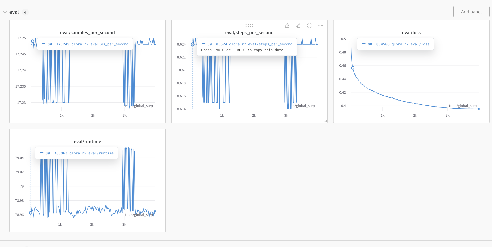

# Fine-tuning Guide with a 4090
This guide walks through the steps to fine-tuning a smallish model (7B) on local hardware end-to-end.

The end-to-end process is, 
1. Pick a base pre-trained model and dataset
2. Run the process.
3. Compute final eval score with `human-eval`.

For this guide let's reproduce the fine-tuning process for [`glaiveai/glaive-coder-7b`](https://huggingface.co/glaiveai/glaive-coder-7b).

Before starting the process, create a virtual environment for python (using venv, conda etc) and activate it.

### Pick a base pre-trained model and dataset

I have a 4090 with 24GB of RAM and if we use 16 bit floating point numbers, we should be able to fit a 7B parameter model (about 14GB of RAM used) on this GPU with enough overhead to run other operations.

The `glaive-coder-7b` model is fine-tuned on `codellama/CodeLlama-7b-Instruct-hf` and we will use this model as the base model.

The glaive model used data prepared by `glaive ai` and we will use the same. There are some considerations toward acquiring and preparing the data for fine-tuning but we will not cover that in this guild. Let's use `TokenBender/glaive_coder_raw_text` from huggingface which has the dataset ready to go.

### Run the process

#### HuggingFace and WandB login

First let's log into hugging face and wandb. We need hugging face authentication to download models, and we are using wandb to track the progress of the fine-tuning process. We can log into both services using the following shell commands which will ask for user credentials,

```bash
pip install -q -U trl transformers accelerate git+https://github.com/huggingface/peft.git

pip install -q -U datasets bitsandbytes einops scipy wandb sentencepiece

git config --global credential.helper store

huggingface-cli login
wandb login
```

If you don't have an account with these services you will have to create one. For hugging face you need to create an API keys in the account settings page. WandB requires creating a project and which will generate a key unique for that project. The `git config` command will help save the credentials for reuse.

#### Axolotl

We will use axolotl to do the heavy-lifting with the fine-tuning. The library is setup to quickly use either LoRA or QLoRA to perform fine-tuning. This guide does not cover the details of those processes, and we are not performing a full fine-tune. We will specifically use QLoRA for this guide because it's relatively faster.

The axolotl repo can be found [here](https://github.com/OpenAccess-AI-Collective/axolotl#quickstart-). We will uses the steps in the quick start section from the repo's readme.

First let's install the libraries,

```bash
git clone https://github.com/OpenAccess-AI-Collective/axolotl
cd axolotl

pip3 install packaging
pip3 install -e '.[flash-attn,deepspeed]'
pip3 install -U git+https://github.com/huggingface/peft.git
```


Next, let's modify the config script in this repo. The config file should be under `axolotl/examples/code-llama/7b/` inside the root of the repo. We are using the CodeLlama model, so first find the qlora config (`axolotl/examples/code-llama/7b/qlora.yml`) and modify the following fields in the yaml file with the values below,

```yaml
base_model: codellama/CodeLlama-7b-Instruct-hf
base_model_config: codellama/CodeLlama-7b-Instruct-hf


datasets:
  - path: TokenBender/glaive_coder_raw_text

sequence_len: 2048

wandb_project: <add-project-created-from-wandb>
wandb_entity: <add-wandb-username>
wandb_run_id: <pick-a-unique-string>

num_epochs: 1
```


Now let's run axolotl\ using accelerate,
```bash
accelerate launch -m axolotl.cli.train axolotl/examples/code-llama/7b/qlora.yml
```

This should launch the process and when it complete (about 10 hours or more) you should see the training results on wandb. You will also see a similar graph on wandb for training loss. The loss metric is how you determine if the fine-tuning is successful or not (it should be similar to the screenshot below).




Axolotl will also save the qlora layer output in a folder called `qlora_output`. You should see that in the dir from which you started the accelerate command above.

#### Merge Layers

Given the `qlora-out` folder, we need to merge the layers into a single model that can then be used for inference and eval. We will rely on peft to perform this step. The guide does not cover the details of that library.

First make sure to install the packages required if you choose to use a different virtual env or just install `peft`.

```bash
pip install -q -U accelerate transformers peft protobuf sentencepiece
```


The following code is setup to run as is using the outputs form the previous step and will upload a fine-tuned model to hugging face with the model name that matches `output_dir` in the code below.

```python
from transformers import AutoModelForCausalLM, AutoTokenizer
from peft import PeftModel
import torch

base_model_name_or_path = "codellama/CodeLlama-7b-Instruct-hf"
peft_model_path = "qlora-out". # <------- READER NOTE
output_dir = "finetune-guide-glave-repro". # <----- READER NOTE: merge output
device = "cuda:0"  # or specify a specific device like "cuda:1"
push_to_hub = True # or True if you want to push to the hub

print(f"Loading base model: {base_model_name_or_path}")
if device == 'auto':
    device_arg = { 'device_map': 'auto' }
else:
    device_arg = { 'device_map': { "": device} }

base_model = AutoModelForCausalLM.from_pretrained(
    base_model_name_or_path,
    return_dict=True,
    torch_dtype=torch.float16,
    **device_arg
)

## The merge step
print(f"Loading PEFT: {peft_model_path}")
model = PeftModel.from_pretrained(base_model, peft_model_path, **device_arg)
print(f"Running merge_and_unload")
model = model.merge_and_unload()

tokenizer = AutoTokenizer.from_pretrained(peft_model_path)

if push_to_hub:
    print(f"Saving to hub ...")
    model.push_to_hub(f"{output_dir}", use_temp_dir=True)
    tokenizer.push_to_hub(f"{output_dir}", use_temp_dir=True)
else:
    model.save_pretrained(f"{output_dir}")
    tokenizer.save_pretrained(f"{output_dir}")
    print(f"Model saved to {output_dir}")
```


After the upload you should be able to see the new model on huggingface under your account.

###  Compute final eval score with `human-eval`

To compute the eval score we will use OpenAI `human-eval` and perform inference on that dataset. The setup instructions are borrowed from this mirror of the WizardLM [git repo](https://github.com/TokenBender/WizardLM/tree/main/WizardCoder#humaneval).

First install `human-eval` using the instruction in [that repo](https://github.com/openai/human-eval),

```bash
git clone https://github.com/openai/human-eval

pip install -e human-eval
```


Next, let's install `vllm` for faster inference,

```bash
pip install vllm
```


Now let's run the following shell command to generate human-eval inference output,

```bash
model="<huggingface path>" # like `hf-user-name/fine-tune-model`
temp=0.2
max_len=1024
pred_num=1
num_seqs_per_iter=``

output_path=preds/T${temp}_N${pred_num}

mkdir -p ${output_path}
echo 'Output path: '$output_path
echo 'Model to eval: '$model

CUDA_VISIBLE_DEVICES=0 python humaneval_gen_vllm.py --model ${model} \
  --start_index 0 --end_index 164 --temperature ${temp} \
  --num_seqs_per_iter ${num_seqs_per_iter} --N ${pred_num} --max_len ${max_len} --output_path ${output_path} --num_gpus 1
```

This should produce a folder and json files under `preds/T0.2_N1` (`output_path` variable in the code).

Now let's run the scoring function to compute the score,

```bash
output_path=preds/T${temp}_N${pred_num}

echo 'Output path: ' $output_path

python process_humaneval.py --path ${output_path} --out_path ${output_path}.jsonl --add_prompt

evaluate_functional_correctness ${output_path}.jsonl
```

and you should see a final score in the shell output,

```json
{'pass@1': 0.3902439024390244}
```

which completes the fine-tuning process.

For this guide we have only one epoch which produced a fairly decent 39% pass score for a 7b parameter model.
